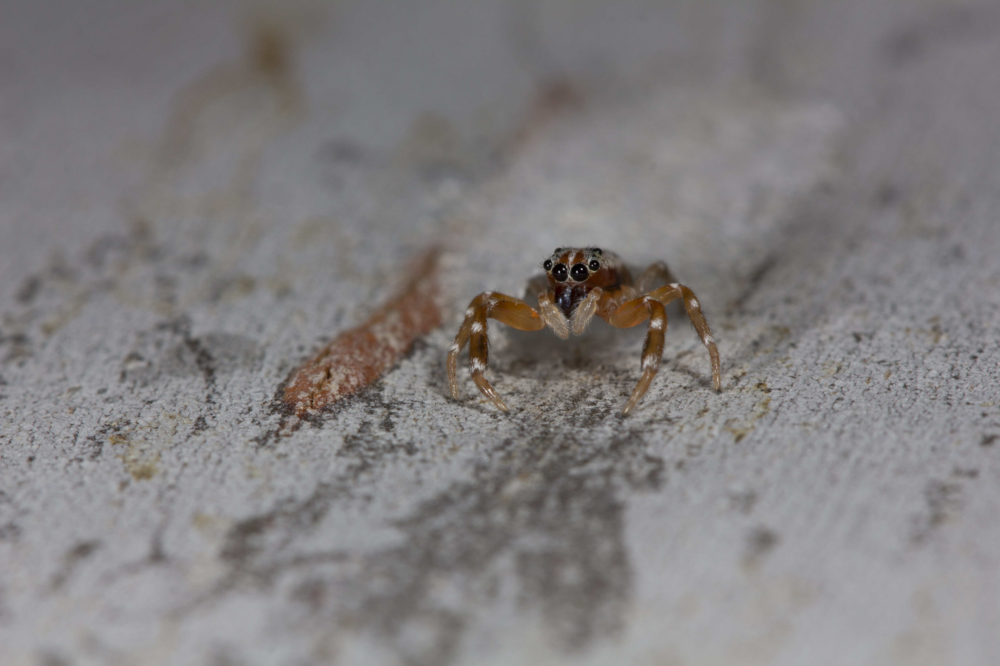

# Novel decorating behaviour of silk retreats in a challenging habitat

**Authors:**

Alfonso Aceves-Aparicio\*^1, 2^, Donald James McLean^1^, Zoe Korzy Wild^1^, Jutta M. Schneider^2^ and Marie E. Herberstein^1^

1, Department of Biological Sciences, Macquarie University, Sydney, NSW, 2109, Australia

2, Institute of Zoology, Universität Hamburg, Hamburg, Germany

Corresponding author: Alfonso Aceves-Aparicio Correspondence: [bioarach\@gmail.com](mailto:bioarach@gmail.com)

   

This repository contains the data and code used to generate stats and figures  
   
Glimpse at the full code and outcome material utilised in this work [here](<https://ponchoaceves.github.io/Blankie-natural-history/BlankieNH#>)

*Arasia mullion* - the blankie spider
